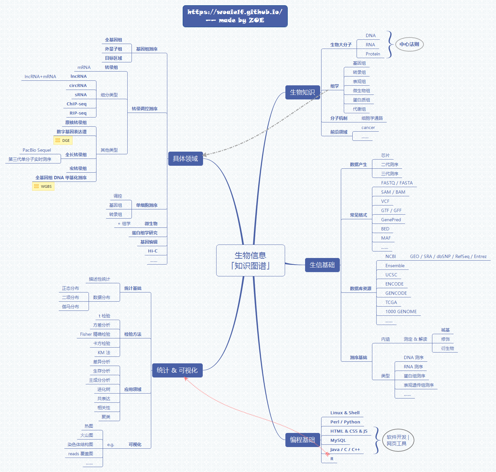

# 生物信息学入门最佳实践

> 首先通过去可视化方法来熟练使用基于**linux系统的服务器**，在此基础上实践两三个**NGS组学**数据分析流程，实践过程需要学习获得数据格式，数据库资源等生物信息学背景。基再学习perl/python/R的**编程基础**，并应用于NGS组学数据分析的下游，个性化分析。

## 服务器使用

基本配置是8G内存+0.5T硬盘(配置不达标问题也不大)，系统可以是ubuntu,centos等**linux系统**，或者 **MAC**，或者改进版的Windows系统。

#### linux系统

建议使用debian

#### MAC系统

如果是苹果电脑，那么非常适合做生物信息学数据分析。需要安装**brew,textwranger,filezilla**

#### windows电脑

大多数人都是这个操作系统，如果是Windows10系统，那么开始其内置的ubuntu即可。如果是其它Windows版本，就需要安装虚拟机，在虚拟机里面安装ubuntu,centos等**linux系统**。

对于Windows用户还需要下载安装好 **xshell,winscp,everything,notepad++,git**或者同等功能的软件。

#### 三系统共用软件

无论是哪种电脑操作系统，都需要安装anaconda,pycharm,R/Rstudio,typora 

上面提到的软件的简介和部分网址如下：

- anaconda 为了学习Python，conda自带科学计算的python包(安装Python3.6.x版本的)；
- pycharm community(三平台通用的 ),Python学习的IDE(社区版）；
- git 虚拟shell界面，为了在window下使用一些shell命令，自带Perl;
- R/Rstudio 为了学习R语言来进行数据处理和统计绘图(安装最新版本)；
- Xshell 远程连接服务器 （安装时点击免费版） ；
- Winscp 为了本地与远程服务器间安全的复制文件；
- Xming 为了图形化显示远程服务器的应用、显示图片、浏览器等； 
- Vmware 为了在windows下面安装Linux虚拟机，同时选择一个国内镜像下载自己喜欢的Linux版本ios镜像;
- Everything 为了可以在windows下快速找到文件；
- notepad++ 为了可以在windows下编写脚本或查看文本文件；
- ActiveState/Strawberry Perl 为了在windows下学习Perl，但git自带Perl，可以选择不安装；
- 有道/为知云笔记/印象笔记 记录学习笔记，构建知识体系(建议使用两个云笔记软件，一个用于原创，一个用于网络资料收集);
- typora 学习markdown语法，查看老师提供的md格式的讲义；

- perl https://www.activestate.com/activeperl/downloads 
- miniconda https://conda.io/miniconda.html 
- R https://cloud.r-project.org/  
- rstudio https://www.rstudio.com/products/rstudio/download/ 
- Xshell https://www.netsarang.com/products/xsh_overview.html
- winscp https://winscp.net/eng/docs/lang:chs 

- ubuntu http://cn.ubuntu.com/download/
- 虚拟机管理工具 vmware workstation  https://www.vmware.com/products/workstation.html

### 去可视化熟悉linux命令

- 鸟哥的linux私房菜 （入门重点看4-12章即可）
- 在线查询linux命令
  - http://man.linuxde.net/
  - https://jaywcjlove.github.io/linux-command/
- 在线学习网站
  - https://www.shiyanlou.com/courses/1
  - http://www.imooc.com/learn/175
  - http://www.runoob.com/linux/linux-tutorial.html

## 生物信息入门基本知识

### 数据产生

- 产生方式
  - arrary
  - genome tiling arrary
  - high throughput sequencing
  - snp arrary
  - protein arrary
- 数据种类
  - expression profiling
  - genome binding/occupancy profiling
  - genome variation profiling
  - methylation profiling
  - non coding rna profiling
  - protein profiling
  - snp genotyping
- 二代测序
  - 454
  - SOLiD
  - illumina https://www.illumina.com.cn/ 
    给出illumina官网的地址是因为里面资料很多。
- 三代测序
  - PacBio RS
  - Nanopore MinlON

### 数据存储类型

- 学习网址 https://genome.ucsc.edu/FAQ/FAQformat.html
- FASTA
- FASTQ
- GFF/GTF
- SAM
- BAM
- CRAM
- VCF
- 其他

### 数据库资源

- 拟南芥
  - TAIR https://www.arabidopsis.org/
  - araport https://www.araport.org/
- 水稻
  - rapdb http://rapdb.dna.affrc.go.jp/
  - msu http://rice.plantbiology.msu.edu/
  - ricexpro http://ricexpro.dna.affrc.go.jp/
- 其他物种
  - JGI https://phytozome.jgi.doe.gov/pz/portal.html#
- NCBI
  - GEO https://www.ncbi.nlm.nih.gov/geo/
  - SRA https://www.ncbi.nlm.nih.gov/sra
  - 其他
- ENSEMBL
  - 在线学习 https://www.ebi.ac.uk/training/online/
  - EnsemblPlants http://plants.ensembl.org/index.htmls
- 蛋白
  - EBI http://www.ebi.ac.uk/services/proteins
  - pfam http://pfam.xfam.org/
  - uniprot http://www.uniprot.org/
  - GPOFILER http://biit.cs.ut.ee/gprofiler/index.cgi
  - GO http://www.geneontology.org/
- 生物信息工具查询网站
  - https://bioinformatics.ca/links_directory/
  - https://omictools.com/
  - https://www.atum.bio/resources/bioinformatics-tools
  - https://wiki2.org/en/List_of_RNA-Seq_bioinformatics_tools

## 生物信息统计入门基础

- 基本概念
- 统计方法
- 实现方法
- 结果可视化
- 相关软件算法实现

## 编程基础

- Linux shell
- R http://www.sthda.com/english/
- Python
- 机器学习
- 在线课程
  - 生信编程题目练习 http://rosalind.info/problems/locations/
  - 慕课网 http://www.imooc.com/

## 生物学基础知识

- 基因组相关
- 转录组相关
- 表观组相关
- 在线课程网站
  - coursera https://www.coursera.org/
  - edX https://courses.edx.org/

## 思维导图

### 本章节作者：思考问题的熊

